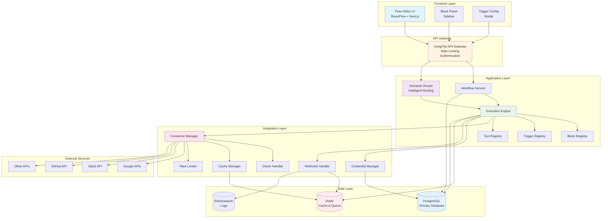
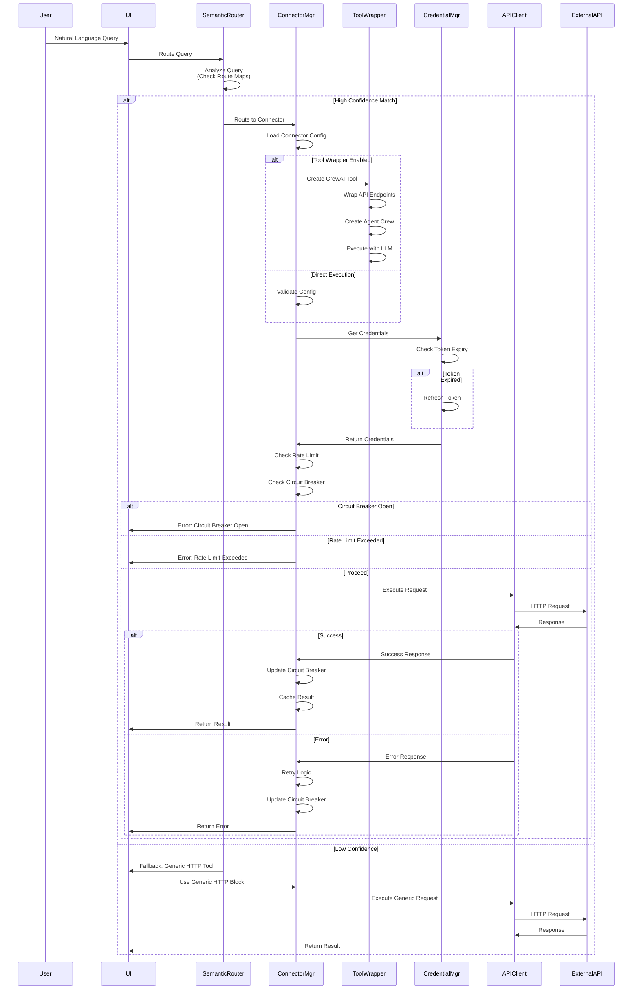
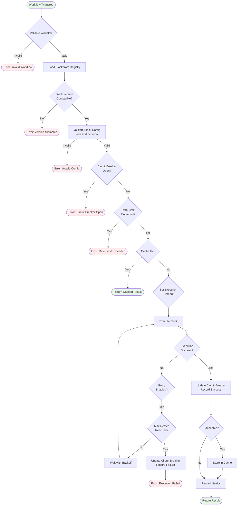
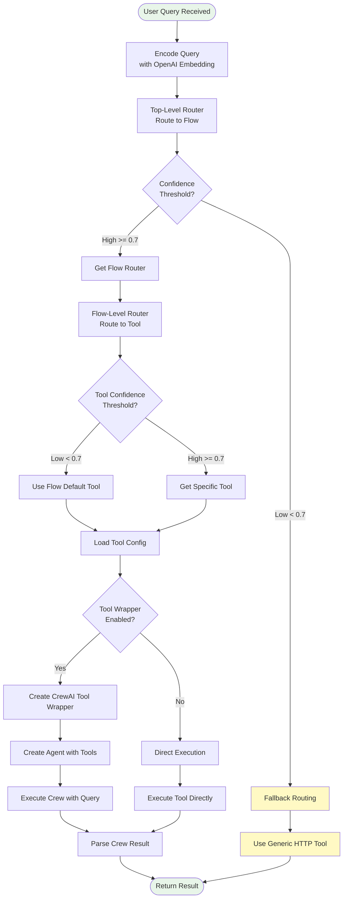
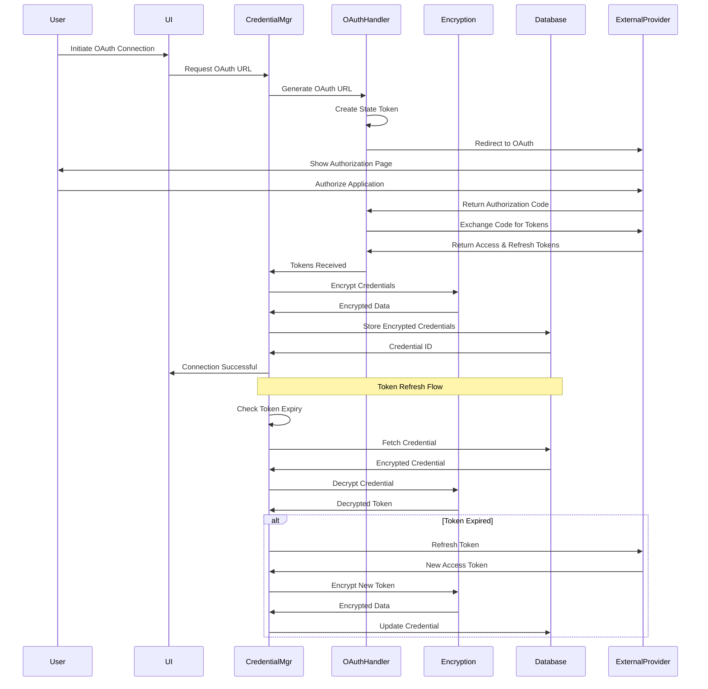
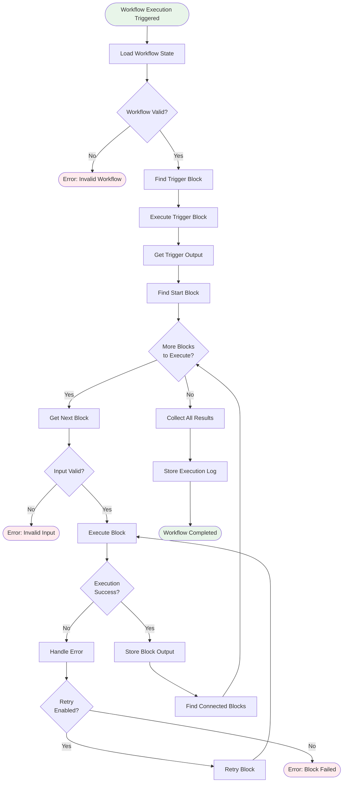
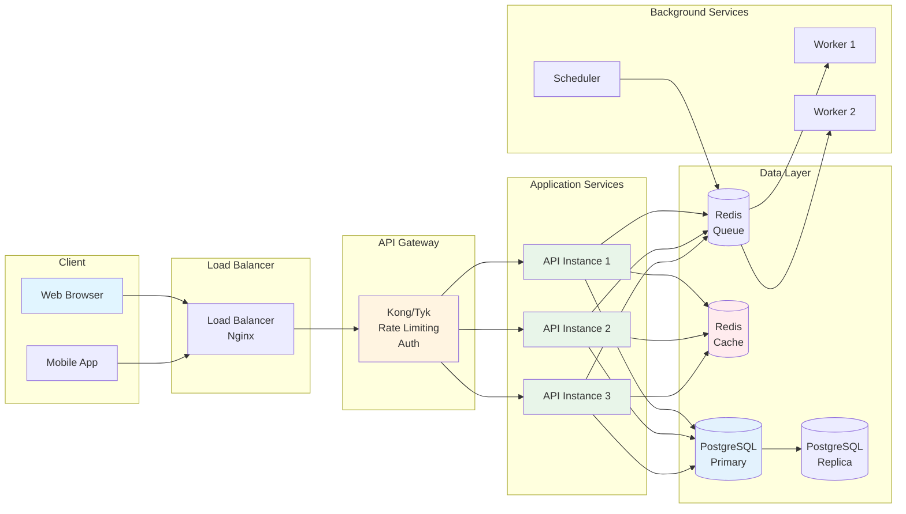
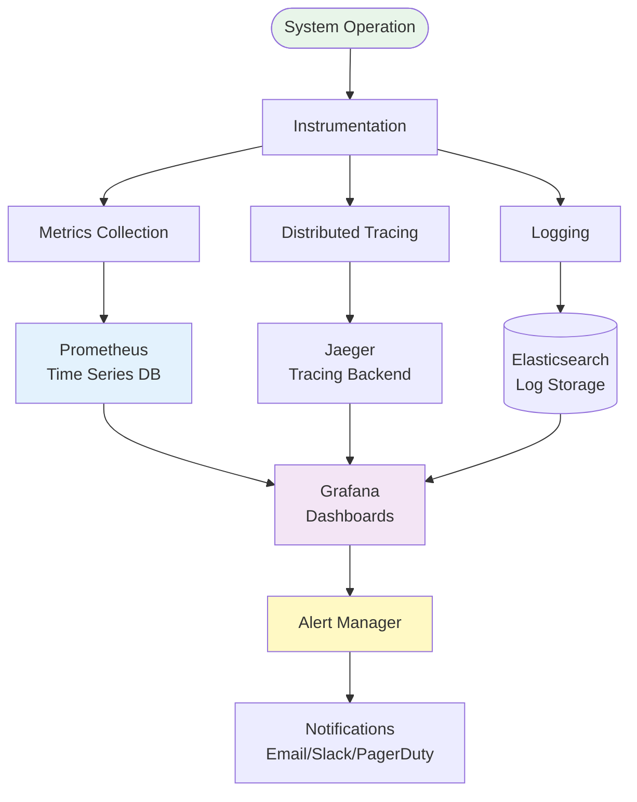

# System Architecture Diagrams (Mermaid Format)

## Overview

This document contains Mermaid-format diagrams for the complete system architecture, including third-party API integration flows. The architecture incorporates patterns from [OpenMetadata](https://open-metadata.org/) (connector management) and [ShaderFrog](https://shaderfrog.com/2/) (visual composition).

---

## Complete System Flow Diagram



## Third-Party API Integration Flow



## Block Execution Flow



## Trigger Activation Flow

```mermaid
flowchart TD
    Start([User Creates Trigger]) --> Validate{Validate Trigger<br/>Config}
    Validate -->|Invalid| Error1([Error: Invalid Config])
    Validate -->|Valid| CheckType{Trigger Type?}
    
    CheckType -->|Webhook| WebhookFlow[Webhook Flow]
    CheckType -->|Polling| PollingFlow[Polling Flow]
    CheckType -->|Schedule| ScheduleFlow[Schedule Flow]
    CheckType -->|Manual| ManualFlow[Manual Flow]
    
    subgraph WebhookFlow[Webhook Activation]
        WebhookFlow --> GeneratePath[Generate Webhook Path]
        GeneratePath --> StoreMapping[Store Path Mapping]
        StoreMapping --> VerifySig{Verify Signature<br/>Required?}
        VerifySig -->|Yes| HandleChallenge[Handle Challenge Response]
        VerifySig -->|No| Activate[Activate Webhook]
        HandleChallenge --> Activate
    end
    
    subgraph PollingFlow[Polling Activation]
        PollingFlow --> SetInterval[Set Polling Interval]
        SetInterval --> StartPoll[Start Polling Loop]
        StartPoll --> PollAPI[Poll External API]
        PollAPI --> ProcessItems{New Items?}
        ProcessItems -->|Yes| QueueExecution[Queue Workflow Execution]
        ProcessItems -->|No| Wait[Wait for Interval]
        QueueExecution --> Wait
        Wait --> PollAPI
    end
    
    subgraph ScheduleFlow[Schedule Activation]
        ScheduleFlow --> ParseCron[Parse Cron Expression]
        ParseCron --> ValidateCron{Valid Cron?}
        ValidateCron -->|No| Error2([Error: Invalid Cron])
        ValidateCron -->|Yes| ScheduleJob[Schedule Job in Queue]
        ScheduleJob --> Activate
    end
    
    subgraph ManualFlow[Manual Activation]
        ManualFlow --> CreateButton[Create Manual Trigger Button]
        CreateButton --> Activate
    end
    
    Activate --> StoreTrigger[Store Trigger in DB]
    StoreTrigger --> Monitor[Start Monitoring]
    Monitor --> Success([Trigger Activated])
    
    style Start fill:#e8f5e9
    style Success fill:#e8f5e9
    style Error1 fill:#ffebee
    style Error2 fill:#ffebee
```

## Semantic Routing Flow



## Credential Management Flow



## Workflow Execution Flow



## System Component Interaction



## Monitoring & Observability Flow



---

## How to Use These Diagrams

### For Draw.io

1. Open [draw.io](https://app.diagrams.net/)
2. Go to **File → Import From → Device**
3. Copy the Mermaid code
4. Draw.io doesn't natively support Mermaid, but you can:
   - Use [Mermaid Live Editor](https://mermaid.live/) to convert to SVG
   - Import the SVG into draw.io
   - Or manually recreate using draw.io shapes

### For Mermaid Live Editor

1. Go to [https://mermaid.live/](https://mermaid.live/)
2. Paste any diagram code
3. Export as PNG, SVG, or copy the link

### For Documentation

These diagrams can be embedded directly in Markdown files if your documentation platform supports Mermaid (GitHub, GitLab, many wikis).

### For Presentations

Export as PNG/SVG from Mermaid Live Editor and import into PowerPoint, Keynote, or Google Slides.

---

## UI Flow Components (OpenMetadata & ShaderFrog)

### Connector Browser (OpenMetadata Pattern)

The connector browser UI (inspired by OpenMetadata) appears in the Frontend Layer, providing:
- Visual connector discovery with categorized browsing
- Search and filter capabilities
- One-click connection initiation

### Visual Editor (ShaderFrog Pattern)

The flow editor UI incorporates ShaderFrog patterns:
- Inline parameter controls on nodes
- Real-time preview of API requests/responses
- Visual feedback during configuration
- Drag-and-drop connector placement

These UI components enhance the user experience for API integration workflows.

---

## Related Documentation

- **Production System Design**: See `PRODUCTION_SYSTEM_DESIGN.md` for complete architecture
- **Third-Party API Structure**: See `THIRD_PARTY_API_STRUCTURE.md` for connector structure
- **Integration Flow**: See `THIRD_PARTY_API_INTEGRATION_FLOW_EXPLAINED.md` for detailed flow explanation
- **UI Flow Patterns**: See `OPENMETADATA_SHADERFROG_UI_PATTERNS.md` for UI implementation patterns
- **Best Approach**: See `BEST_API_INTEGRATION_APPROACH.md` for recommended integration approach
- **Integration Patterns**: See `THIRD_PARTY_API_INTEGRATION_PATTERNS.md` for integration patterns

---

*All diagrams are optimized for production system architecture visualization. UI patterns inspired by OpenMetadata (connector management) and ShaderFrog (visual composition).*

